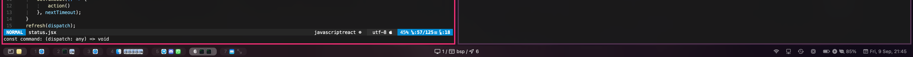
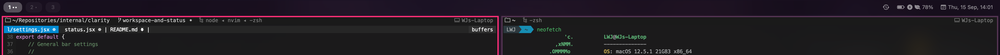
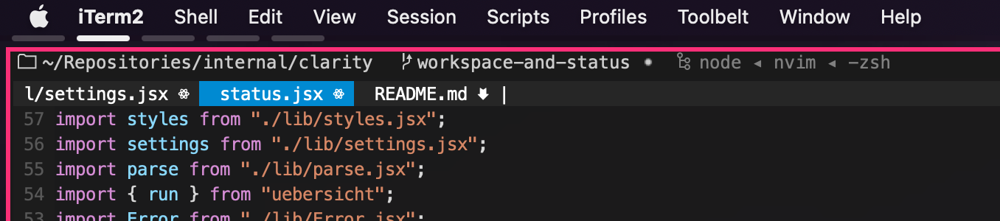

# Showcase

Here is some functionality that you can expect from Clarity v3.

By default, it gives workspace indicators on the left, yabai status at the center and some other miscellaneous status items at the right. App icons are extracted from the .app bundle automatically and shown when opened. Your wallpaper is automatically blurred when you have any window open in the current space.

You can perform some basic customisation of its style via the `lib/settings.jsx` file, while preserving its design language. For example, you can choose a minimal design mode, adjust the sizes and toggle between top and bottom alignment:

Or by simply reducing the height value, you can shrink it down to a space-only indicator, which can be used and remain visible with yabai paddings alongside the macOS menu bar. Inspired by [@rosenpin's fork of this repo](https://github.com/rosenpin/clarity/tree/ba5ab5fcaab811a295a174baf83f6f37c369bb06).

